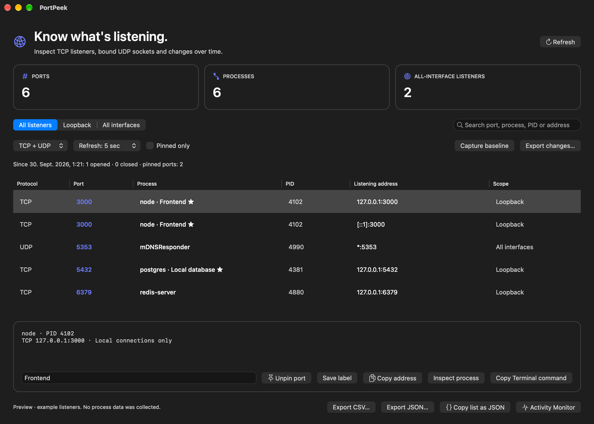
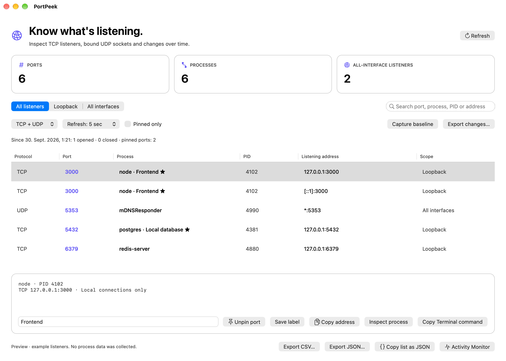

# PortPeek

**Know what’s listening.**

A native Mac utility that connects local TCP listeners and bound UDP sockets to their owning processes. Find the development server occupying a port, inspect its bind address, and copy a clean snapshot.

## What it does

- TCP listeners and unconnected bound UDP sockets, including IPv4/IPv6 addresses.
- Filter protocol, bind scope, process, PID, address or custom port label.
- Pin frequently used ports and label services such as an API or local database.
- Capture a persistent baseline; see opened/closed sockets and export the change report.
- Choose five-, fifteen- or thirty-second refresh, or freeze with manual mode.
- Inspect a selected process command, user and elapsed time through the system `ps` tool.
- Copy an address or Terminal `lsof` command; open Activity Monitor.
- Export filtered CSV/JSON snapshots or copy JSON to the clipboard.
- Read-only CLI socket inventory with protocol, port and scope filters.
- System commands time out after eight seconds; no administrator access is requested.

## Use it

1. Open the app to read local TCP listeners and bound UDP sockets.
2. Search for a port such as `3000`, or choose a scope filter.
3. Select a row to inspect the process and address.
4. Copy the address or filtered JSON when needed.

PortPeek uses the system `/usr/sbin/lsof` without administrator privileges. Visibility depends on your current permissions, and process names are those reported by lsof. It lists TCP listeners and unconnected bound UDP sockets, excluding established TCP connections and connected UDP endpoints. An all-interface bind is not proof of internet reachability: routing and firewall rules also matter. It does not stop processes or change network settings. The three counters describe the full scan; snapshot CSV/JSON exports the filtered rows. Baselines and custom port labels are stored in local UserDefaults.

## Automation and integrations

```sh
tool="/Applications/PortPeek.app/Contents/MacOS/PortPeek"
"$tool" list --protocol=All --format=json
"$tool" list --protocol=TCP --port=3000 --scope=loopback
"$tool" list --protocol=UDP --format=csv > bound-udp.csv
```

The CLI sends system warnings to stderr and data to stdout. Shell redirection follows normal shell overwrite behavior. Baseline changes compare observed sockets, including PID, protocol, address and process. Short-lived sockets between refreshes can be missed; an opened/closed count is not a continuous traffic history. Pins and labels are keyed by port number across protocols. The baseline records all protocols regardless of the active table filter.

## Privacy

Process inspection is local and read-only. There is no network scanning, account, telemetry or upload. Clipboard exports happen only when you click a copy button.

## Download

[Download the latest macOS app](https://github.com/leonsuv/PortPeek/releases/latest) · [Build status](https://github.com/leonsuv/PortPeek/actions)

Requires **Apple Silicon (M1 or newer)**. The deployment target is **macOS 13+**; UI testing was performed on macOS 27. Intel builds are not supplied. The release ZIP contains `PortPeek.app` and the release also provides `SHA256SUMS.txt`.

Unzip and move the app to Applications. Builds are ad-hoc signed and are **not Developer ID signed or notarized**. macOS may require approval under **System Settings → Privacy & Security → Open Anyway** before the first launch.

## Appearance

Uses AppKit controls, SF Symbols, resizable windows and system typography. Choose **System**, **Light** or **Dark** from the Appearance menu.

### Dark



### Light



These are renders of the actual app window using explicitly labeled example data. They contain no personal files, real process inventory or recorded focus history.

## Build from source

Install Apple Command Line Tools, then:

```sh
git clone https://github.com/leonsuv/PortPeek.git
cd PortPeek
./build.sh
open dist/PortPeek.app
```

No package downloads or third-party runtime libraries are required. `build.sh` compiles the app, runs functional checks and verifies its ad-hoc signature. To rerun checks:

```sh
dist/PortPeek.app/Contents/MacOS/PortPeek --self-test
```

Parser checks cover process grouping, duplicate entries, IPv6 addresses, scopes, invalid ports and JSON fidelity. The live-listener test creates a temporary loopback socket and checks it through the real lsof reader.

Run the live-listener check with `python3 scripts/live-check.py`.

Run the CLI integration check (uses temporary fixtures only):

```sh
python3 scripts/check-cli.py
```

To reproduce the example screenshots:

```sh
./scripts/screenshots.sh
```

Demo mode does not collect real process information or write normal app settings. Screenshots are captured from AppKit’s window view after layout. The icon is drawn from the project’s own vector shapes; regenerate it with `./tools/generate-icon.sh`.

## Releases

A push to `main` runs the macOS build. A `v*` tag builds, checks, packages and publishes a GitHub release with a ZIP and SHA-256 checksum. Release binaries are built by GitHub Actions, not uploaded from a developer’s local working copy.

## License

MIT · [leonsuv](https://github.com/leonsuv)
